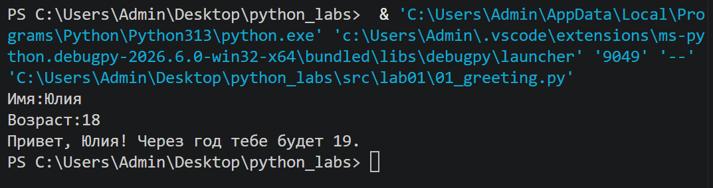
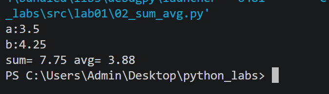
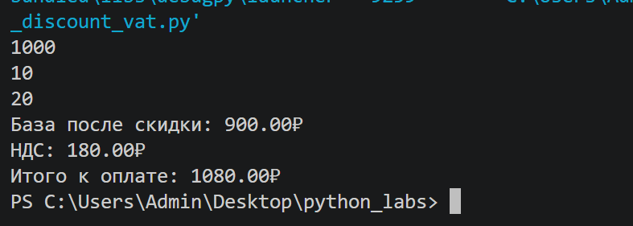
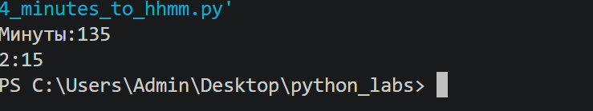
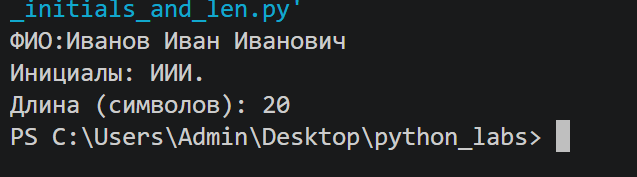
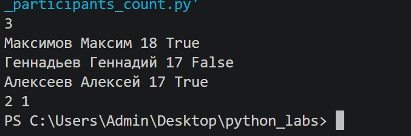
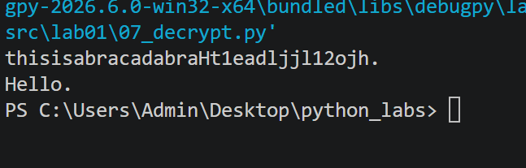

Лабороторные 
Лелькова Юлия, 1 курс, БИВТ-26-6-1
# Лабораторная работа 1 — Ввод/вывод и форматирование

## Задание 1. Приветствие
Программа спрашивает имя и возраст, выводит приветствие и возраст через год.

## Задание 2. Сумма и среднее
Программа считывает два числа (с запятой или точкой), выводит их сумму и среднее.

## Задание 3. Скидка и НДС
Программа считает цену после скидки, сумму НДС и итоговую сумму к оплате.

## Задание 4. Минуты в часы и минуты
Программа переводит количество минут в формат ЧЧ:ММ.

## Задание 5. Инициалы и длина ФИО
Программа выводит инициалы по ФИО и длину строки без лишних пробелов.

## Задание 6*. Подсчёт участников (очно/заочно)
Программа считает, сколько участников присутствовали очно, а сколько заочно.

## Задание 7*. Расшифровка строки
Программа находит первую заглавную букву, вычисляет шаг по первой цифре после неё и собирает зашифрованное слово.

