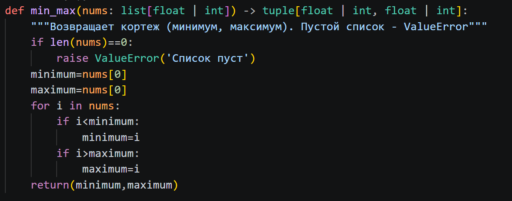
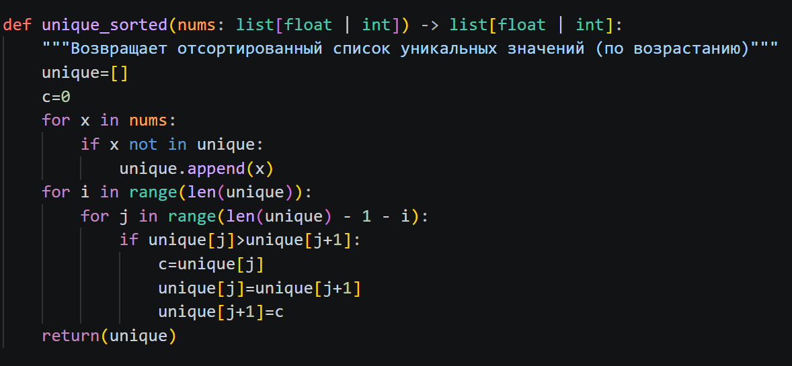
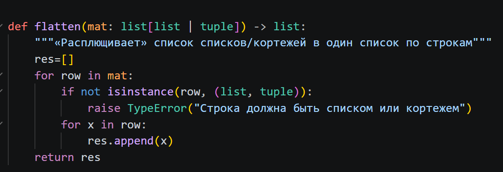
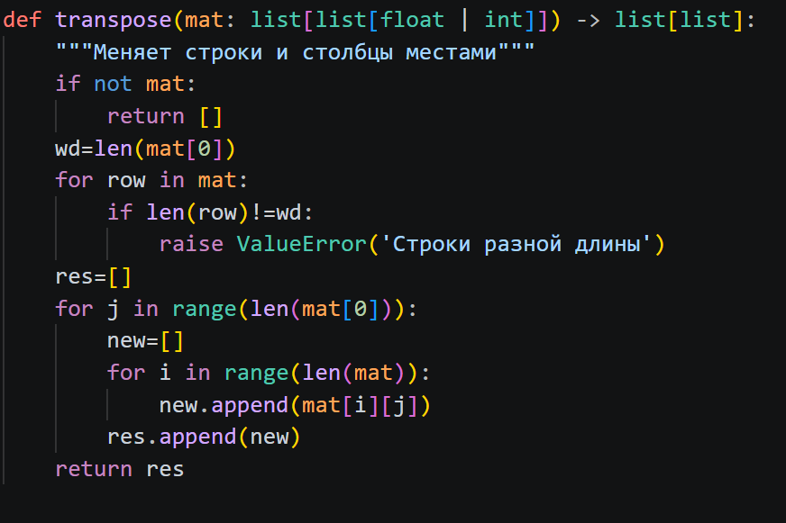
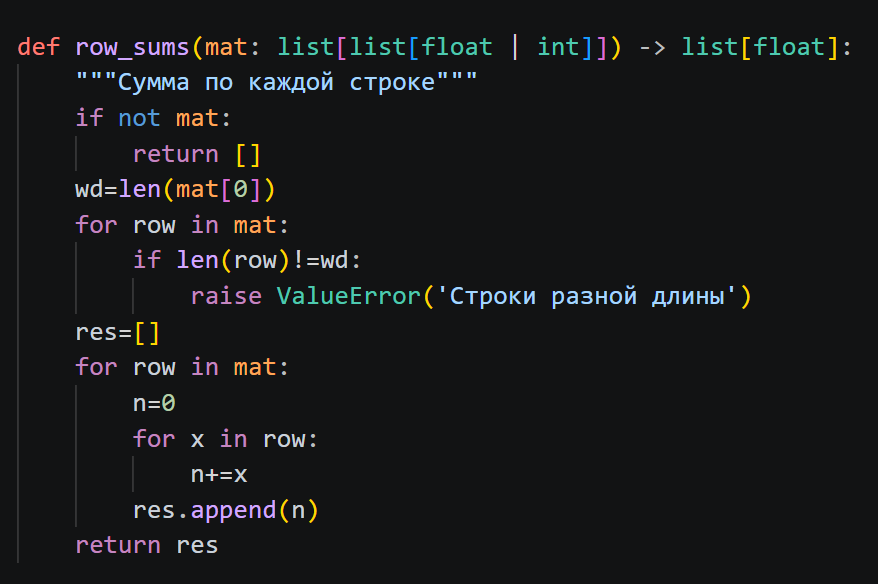
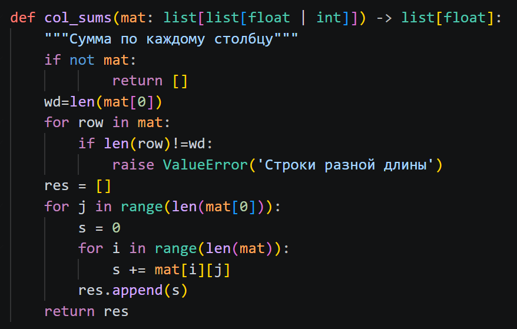
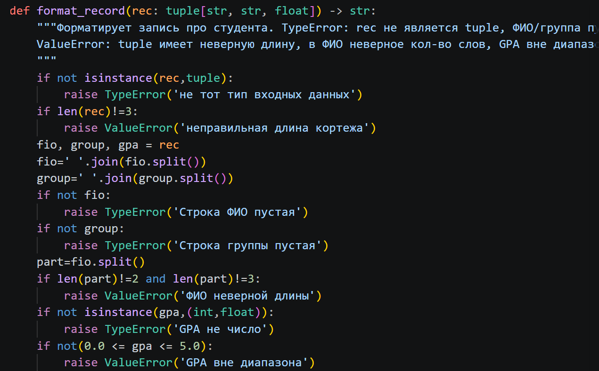
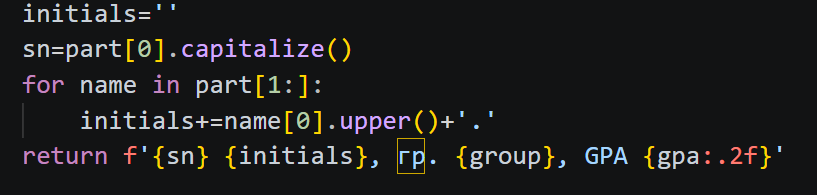

Лабороторные 
Лелькова Юлия, 1 курс, БИВТ-26-6-1
# Лабораторная работа 2 — Коллекции и матрицы (list/tuple/set/dict)

## Задание 1 - arrays.py
min_max() - возвращает минимальное и максимальное значения заданного списка

тест

unique_sorted() - возвращает отсортированный по возрастанию список уникальных значений

тест

flatten() - Объединяет списки и кортежи в один список

тест

## Задание 2 - matrix.py
transpose() - транспонирует матрицу

тест

row_sums() - суммирует элементы в каждой строке

тест

col_sums() - суммирует элементы в каждом столбце

тест

## Задание 3 - tuples.py
format_record() - на вход получает кортеж с ФИО, группой и GPA и создает из него строку с фамилией, инициалами, группой и GPA

тест

