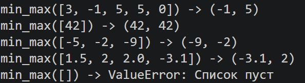
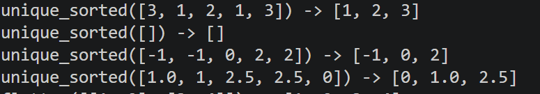
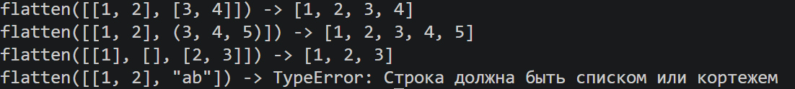
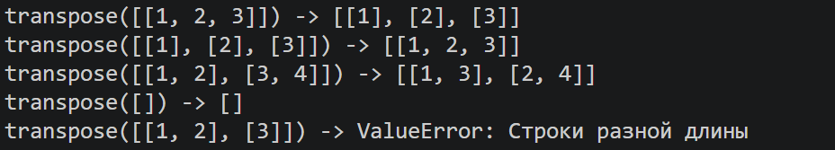
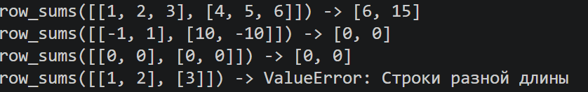
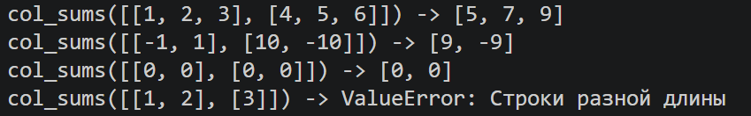
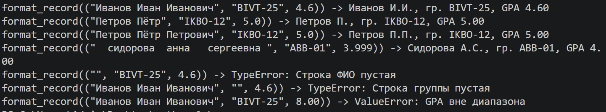

Лабороторные 
Лелькова Юлия, 1 курс, БИВТ-26-6-1
# Лабораторная работа 2 — Коллекции и матрицы (list/tuple/set/dict)

## Задание 1 - arrays.py
min_max() - возвращает минимальное и максимальное значения заданного списка
```python
def min_max(nums: list[float | int]) -> tuple[float | int, float | int]:
    """Возвращает кортеж (минимум, максимум). Пустой список - ValueError"""
    if len(nums)==0:
        raise ValueError('Список пуст')
    minimum=nums[0]
    maximum=nums[0]
    for i in nums:
        if i<minimum:
            minimum=i
        if i>maximum:
            maximum=i
    return(minimum,maximum)
```
### тест


unique_sorted() - возвращает отсортированный по возрастанию список уникальных значений
```python
def unique_sorted(nums: list[float | int]) -> list[float | int]:
    """Возвращает отсортированный список уникальных значений (по возрастанию)"""
    unique=[]
    c=0
    for x in nums:
        if x not in unique:
            unique.append(x)
    for i in range(len(unique)):
        for j in range(len(unique) - 1 - i):
            if unique[j]>unique[j+1]:
                c=unique[j]
                unique[j]=unique[j+1]
                unique[j+1]=c
    return(unique)
```
### тест


flatten() - Объединяет списки и кортежи в один список
```python
def flatten(mat: list[list | tuple]) -> list:
    """«Расплющивает» список списков/кортежей в один список по строкам"""
    res=[]
    for row in mat:
        if not isinstance(row, (list, tuple)):
            raise TypeError("Строка должна быть списком или кортежем")
        for x in row:
            res.append(x)
    return res
```
### тест



## Задание 2 - matrix.py
transpose() - транспонирует матрицу
```python
def transpose(mat: list[list[float | int]]) -> list[list]:
    """Меняет строки и столбцы местами"""
    if not mat:
        return []
    wd=len(mat[0])
    for row in mat:
        if len(row)!=wd:
            raise ValueError('Строки разной длины')
    res=[]
    for j in range(len(mat[0])):
        new=[]
        for i in range(len(mat)):
            new.append(mat[i][j])
        res.append(new)
    return res
```
### тест


row_sums() - суммирует элементы в каждой строке
```python
def row_sums(mat: list[list[float | int]]) -> list[float]:
    """Сумма по каждой строке"""
    if not mat:
        return []
    wd=len(mat[0])
    for row in mat:
        if len(row)!=wd:
            raise ValueError('Строки разной длины')
    res=[]
    for row in mat:
        n=0
        for x in row:
            n+=x
        res.append(n)
    return res
```
### тест


col_sums() - суммирует элементы в каждом столбце
```python
def col_sums(mat: list[list[float | int]]) -> list[float]:
    """Сумма по каждому столбцу"""
    if not mat:
            return []
    wd=len(mat[0])
    for row in mat:
        if len(row)!=wd:
            raise ValueError('Строки разной длины')
    res = []
    for j in range(len(mat[0])):
        s = 0
        for i in range(len(mat)):
            s += mat[i][j]
        res.append(s)
    return res
```
### тест



## Задание 3 - tuples.py
format_record() - на вход получает кортеж с ФИО, группой и GPA и создает из него строку с фамилией, инициалами, группой и GPA
```python
def format_record(rec: tuple[str, str, float]) -> str:
    """Форматирует запись про студента. TypeError: rec не является tuple, ФИО/группа пустые, GPA не тот тип.
    ValueError: tuple имеет неверную длину, в ФИО неверное кол-во слов, GPA вне диапазона 
    """
    if not isinstance(rec,tuple):
        raise TypeError('не тот тип входных данных')
    if len(rec)!=3:
        raise ValueError('неправильная длина кортежа')
    fio, group, gpa = rec 
    fio=' '.join(fio.split())
    group=' '.join(group.split())
    if not fio:
        raise TypeError('Строка ФИО пустая')
    if not group:
        raise TypeError('Строка группы пустая')
    part=fio.split()
    if len(part)!=2 and len(part)!=3:
        raise ValueError('ФИО неверной длины')
    if not isinstance(gpa,(int,float)):
        raise TypeError('GPA не число')
    if not(0.0 <= gpa <= 5.0):
        raise ValueError('GPA вне диапазона')
    initials=''
    sn=part[0].capitalize()
    for name in part[1:]:
        initials+=name[0].upper()+'.'
    return f'{sn} {initials}, гр. {group}, GPA {gpa:.2f}'
```
### тест

